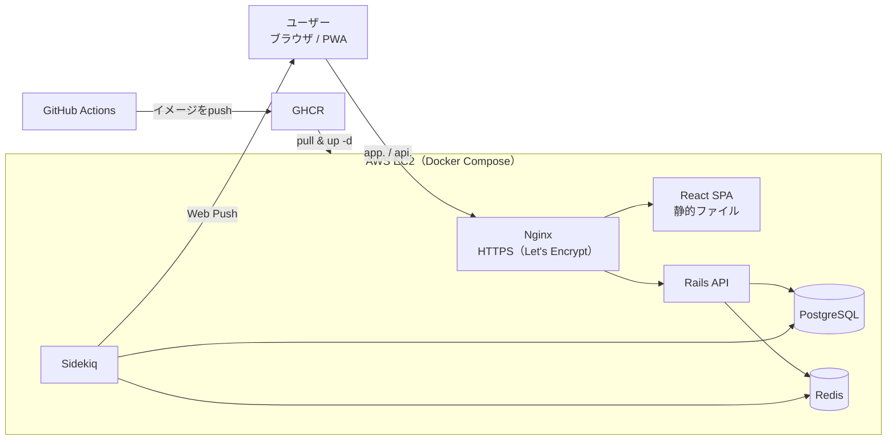

# Unstuck

**「報連相」を「勇気のいらないルーティン」に変えるために**

「何がわからないかがわからない」若手エンジニアが、詰まりを気軽に伝えられるようにする、進捗報告・詰まり管理アプリです。

| | |
|---|---|
| 公開URL | 準備中 |
| MVP版（RUNTEQ卒業制作） | [takaQ-hash/Unstuck-app](https://github.com/takaQ-hash/Unstuck-app)（Rails / Hotwire） |
| 画面遷移図 | [Figma](https://www.figma.com/design/I4hw6jXHypjp71TvWb5uX7/%E7%94%BB%E9%9D%A2%E9%81%B7%E7%A7%BB%E5%9B%B3_Unstuck?m=auto&t=YTxbHeklOMMo6iyh-1)（本リリース版に更新中） |
| ER図 | 本リリース版に更新中 |
| 開発状況 | 設計フェーズ（MVPを React + Rails API mode で作り直しています） |

---

## 1. Unstuckとは

進捗を「**進行中**」か「**奮闘中**」の2択で報告するだけの、若手エンジニア向けの進捗報告・詰まり管理ツールです。

- **30秒で報告が終わる**：入力は最小限とし、進捗報告のハードルを限りなく低くします。
- **個人利用から始められる**：最終的にはチーム内使用を目指いますが、まずは自分で自分の状態を把握する目的で使い始められます。
- **ただの「状態」を記録**：「詰まっているかどうか」ではなく、「今ここに時間を使っている」という状態を記録します。これは助けを求める合図でも、失敗の報告でもありません。

既存ツールが「管理する側」のために進捗を見える化するのに対し、Unstuckは**「報告する側」の不安を減らすこと**に特化しています。

---

## 2. 開発理由

### 2-1. きっかけ

SESエンジニアとして初めて既存システムの改修を担当したとき、読むべき資料の多さに一人でパニックになりました。資料のまとめ方は現場ごとにバラバラで、記述ルールや命名規則、リーダーとの距離感も現場ごとに違います。

「何がわからないかがわからない」「誰に聞けばいいかわからない」まま進めた結果、次のような負のスパイラルに陥りました。

```
何を・誰に質問すればいいかわからない
  ↓
時間だけが過ぎる
  ↓
自分の中での情報整理が長引き、深みにはまる
  ↓
抜け出せない
```

**報連相を、関係性や気合ではなく「仕組み」で解決したい** と思ったことが開発の動機です。

### 2-2. 想定ユーザー

**過去の自分**です。

- 実務経験1〜3年程度、20〜30代前半のエンジニア（SES・受託開発）
- リモートワークまたは常駐で、報告の手段がチャット中心
- 詰まったときに「誰に・何を・どう聞くか」で迷い、文章を書くことにも苦手意識がある

### 2-3. 既存ツールとの違い

| 既存ツール | 主な目的 | Unstuckで補える点 |
|---|---|---|
| Jira / Backlog | プロジェクトの完遂 | チケットにする前の「何がわからないかわからない」段階を扱う |
| Asana / Notion | 情報の整理・可視化 | 入力項目を絞り、報告の「型」を考えるコストをなくす |
| gamba! | 組織のエンゲージメント（日報） | 進捗と詰まりを一体で扱い、エンジニアの業務に特化する |
| Slack / Teams | リアルタイムの会話 | 流れてしまう情報を、詰まりのパターンとして蓄積する |

---

## 3. 課題と解決アプローチ

### 3-1. 「詰まる」の定義

エラーの有無は関係なく、以下のような**「前に進めない、でも何をすべきかわからない状態」**全般を指します。

- **情報収集において**：資料の場所がわからない／検索してもヒットしない／どの資料が正しいかわからない
- **思考整理において**：質問をまとめる時間／原因が特定できない／どこから手をつけるか決められない
- **対人コミュニケーションにおいて**：質問のタイミングを見計らう／「聞いていいのか」とためらう

### 3-2. 進捗ステータス

| ステータス | 意味 | 具体的な状態 |
|---|---|---|
| **進行中** | 滞りなく進んでいる | 手が動いている・解決の見通しがある |
| **奮闘中** | 取り組んでいるが、一人では進みにくい | 資料を探している・原因が特定できない・質問を整理している |

### 3-3. 本当に解決したい課題

このアプリでは、報連相が遅れるのは「何をどう報告すればいいかわからないから」、つまり「自分の状況をうまく言語化できていないから」と考えをもとにしています。
「言語化する手助け」ではなく、「報告までに考えたり悩んだりする時間を最小限に減らす手助け」が本アプリを使う目的です。

→ **「詰まっていること」を、気軽に、仕組みとして伝えられる手段がない** という問題を解決します。

---

## 4. 機能一覧

設計の基準は、**悩む時間・ためらう時間を1秒でも減らす**ことです。

- 入力は必須項目のみ。30秒以内に報告を完了できる
- 文字を読まなくても、色と配置で全体像がわかる
- スマートフォンでも報告しやすいレスポンシブ対応

### 4-1. MVPで実装済み（本リリースで再実装）

| 機能 | 概要 |
|---|---|
| ユーザー認証 | 新規登録・ログイン・ログアウト（Devise、日本語化） |
| タスク管理 | タスクの作成・一覧・編集・削除（自分のタスクのみ操作可能） |
| 進捗報告 | 「進行中／奮闘中」の2択で報告し、一言メモを任意で残せる |
| 進捗一覧 | 状態を色で把握できるカード形式の一覧 |
| 通知設定 | 「一定間隔」または「固定時刻」でリマインドを設定 |
| Web Push通知 | アプリを閉じていてもブラウザに通知が届く |
| 使い方ガイド | フローチャートの図解で使い方を説明 |
| 利用規約・プライバシーポリシー | 登録時の同意チェックで登録を制御 |

### 4-2. 本リリースで開発

| 機能 | 概要 |
|---|---|
| 通知の精度向上 | 通知時刻にジョブを予約して実行し、取りこぼしを定期チェックで補う |
| 通知履歴 | 送信した通知を記録する |
| タスクごとの通知ON/OFF | タスク単位で通知を切り替える |
| タスククローズ | 完了したタスクを、削除とは別に管理する（タブで切り替え） |
| オンボーディング | 初めて使う人向けのチュートリアル |
| 「奮闘中」が続いたときの促し | 責めずに、相談を後押しするメッセージを表示する |
| 規約改定時の再同意 | 同意日時と規約バージョンを記録し、改定時に再同意を求める |
| パスワード再設定メールの配信 | 再設定メールを実際に送信する |
| WBS／カレンダー表示 | 「タスク軸」と「期間軸」の2つの視点を切り替える |
| 管理者アカウント | チームの詰まり状況を一覧する。助け舟を出すタイミングを知るためのもので、監視用ではない |
| AIアシスト | 蓄積した詰まりデータから、傾向を分析する（方式は実装時に決定） |

### 4-3. 検討中（ユーザーのFBを受けて）

- 未ログインでも価値が伝わるトップページと、登録なしで試せるデモ
- 「詰まりの原因」のタグ付けと、傾向の振り返り
- 報告内容を、Slack／Teams向けの文章としてコピーする機能

### 4-4. あえて作らないもの

- **進捗報告を上司へ自動送信**：自動送信は報告者の自律性を損なうため、報告内容は必ず本人が確認・判断します。
- **監視・評価の機能**：詰まりの可視化は、メンバーを管理・評価するためではなく、助け舟を出すタイミングを知るためのものです。

---

## 5. 技術スタック

### 5-1. 構成図



本番とステージングは、同じEC2上で別のComposeスタックとして動かし、サブドメインで振り分けます。

### 5-2. フロントエンド

| 技術 | 選定理由 |
|---|---|
| TypeScript / Vite / React | ログイン後の画面が中心で、SSRやSEOの恩恵が小さいため、Next.jsではなくViteを使ったSPA方式を選択。API設計・認証・状態管理を自分で設計することにした。 |
| HeroUI v3 / Tailwind CSS v4 | MVPのブランドカラー（グリーン／アンバー）のトークンを引き継げる。アクセシビリティ対応済みのコンポーネントが揃っている。 |
| React Router | 実績と情報量が多い、SPAルーティングの定番で参考資料が豊富なため |
| TanStack Query | サーバーの状態（取得・キャッシュ・再取得・読み込み中）を宣言的に管理する。（素の`useEffect`で書いた実装と比較し、導入の効果を検証する学習にも活用する予定） |
| React Hook Form + Zod | 入力ルールをスキーマで一元管理し、型と連動させる |
| ESLint + Prettier | 導入実績が多く、参考資料が豊富なため |
| Vitest / Testing Library / MSW / Playwright | Viteと設定を共有でき高速で単体テストからE2Eまでを同じ流れで自動化する |
| Service Worker（vite-plugin-pwa） | アプリを閉じていてもWeb Pushを受け取れる（受信処理を自前で書ける方式を選択） |

### 5-3. バックエンド

| 技術 | 選定理由 |
|---|---|
| Ruby on Rails（API mode） | MVPで作ったモデル・認証・テストの資産を活かしつつ、画面とAPIを分離する |
| Devise（セッションCookie） | MVPの資産を継続。HttpOnlyのCookieはトークンの漏洩リスクが低く、同一サイト（サブドメイン）運用なら実装も単純。JWTは、保存場所と失効の設計コストが大きいため見送り |
| PostgreSQL | MVPから継続。将来の詰まりデータの集計・傾向分析に強い |
| Sidekiq + Redis | 通知時刻に正確に送るため、タスク作成時に通知時刻へジョブを予約する。MVPの「1分間隔のポーリング」では、最大1分のズレが避けられなかった。取りこぼしの防止に、定期チェックを併用する |
| Web Push（VAPID） | アプリを開いていなくても届く。メールは気づきにくく、Slack Webhookは利用環境に依存するため見送り |
| RSpec / RuboCop / Brakeman | MVPから継続。テスト、コード規約、セキュリティ診断を自動で実行する |

### 5-4. インフラ・運用

| 技術 | 選定理由 |
|---|---|
| AWS EC2 1台 + Docker Compose | コスト・学習効果・設計の説明しやすさの3点で比較して選択。ECS／RDSは運用の自動化に優れるが費用が高く見送り。MVPのRender無料プランにはバックグラウンドワーカーがなく、通知の正確さを担保できないため移行 |
| 本番・ステージングの2環境 | 追加のサーバー費用なしで、本番と同じ設定の確認環境を用意する。デプロイ前に、本番でしか起きない不具合や、Cookie・CORS・Web Pushの動作を確認する |
| サブドメイン分離（app. / api.） | 同一サイトとしてCookie認証を使いつつ、画面とAPIを独立して扱える。CORSは許可するオリジンを限定する |
| Nginx + Let's Encrypt | 無料でHTTPS化できる。ALB＋ACMは固定費がかかるため見送り |
| PostgreSQL（EC2内のコンテナ）+ S3バックアップ | RDSの固定費を避ける。`pg_dump`をS3へ退避し、復元できることをステージングで確認する |
| Terraform | EC2・セキュリティグループ・IAM・EBS・Route 53などをコードで管理し、環境を再現可能にする（まずは基本範囲のみ） |
| GitHub Actions + GHCR | CI/CDとイメージの保管をGitHubに集約する |
| Sentry | エラー監視のため。無料プランがあり、導入実績が。多い |
| Cursor + Claude Code | 定型的な実装はAIに任せ、設計判断とPRのマージは自分で行う。PRにはAIを使った判断の根拠を記録する |

---

## 6. 設計・運用

- **通知の正確さを改良**：MVPで構造的に避けられなかった最大約1分のズレを、予約実行と定期チェックで解消します。予約時刻と実際の送信時刻を記録し、ズレを数値で確認できるようにする予定です。
- **認可とセキュリティ**：MVPの対策を引き継ぎます（自分のデータのみ操作できるスコープ、オープンリダイレクト対策、Brakemanによる診断）。
- **品質確認を自動化**：CIでテスト・Lint・静的解析を実行します。デプロイ後は、ヘルスチェック、スモークテスト、ステージングでのE2Eを自動で行い、失敗したら直前のバージョンへ戻します。
- **開発の進め方を細分化**：Issueを細かく分け、PRは規約のテンプレートで作成します。
---

## 7. 検証と改善の記録

同僚やRUNTEQの仲間など、想定ユーザーに1〜2週間使ってもらい、次の2点を確認します。

- 報告のハードルは下がったか
- 継続して使えるか

| 時期 | 対象 | 得られた声 | 対応した改善 |
|---|---|---|---|
| 実施予定 | | | |

---

## 8. セットアップ

開発着手後に追記します。

---

## 9. 今後の展開

- 個人利用の強化と、チーム利用への拡張（管理者向けの一覧、AIによる傾向分析）
- 蓄積した詰まりの記録から、個人のパターンを可視化し、見積もり精度の向上に活かす
- ユーザーのフィードバックをもとに、報告を意識しなくても習慣になるUIへ改善を続ける

---

*このREADMEは、開発の進行に合わせて更新します。*
